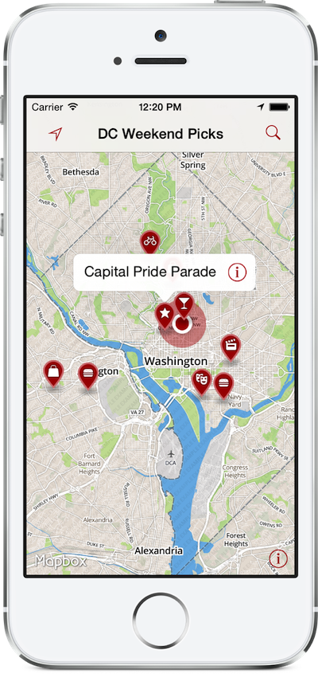

# Mapbox Weekend Picks Template (iOS Edition)

This is the native iOS app to compliment the Mapbox markers example: 

 * Repo: https://github.com/mapbox/weekend-picks-template
 * Blog post: http://mapbox.com/blog/markers

This is a native iOS app with similar functionality. Once you've got a map with markers on it, just configure the following in `MBWPViewController.m`: 

 * `kMapboxMapID`: Map ID for your map on Mapbox
 * `kTintColorHex`: HTML/CSS-style color hex code to match theming with your site

Then, just build & run the app and explore your picks! 

Quick demo video: https://dl.dropbox.com/u/575564/picksvid.mov
